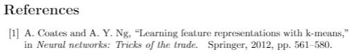

# chapter10-IEEE-paper-LaTeX-format
 最近写了篇IEEE paper，被LaTeX折磨的死去活来总算完工，下面把我用到的LaTeX语法做个笔记，以后肯定也会用到。

------

## 关于引用文献References

新建文件*ref.bib*------>谷歌学术里搜你要引用的论文，找到引用的html源码----->把引用源码copy到*ref.bib*文件里------->在.tex文件里设置格式用\cite{}去调用。 

下面举例说明：

```
\usepackage{cite}
\begin{document}
#下面两句放到引用文献部分
\bibliographystyle{ieeetr}
\bibliography{ref}
\end{document}
```

比如你在文章中要引用：we can see that from *\cite{coates2012learning}* .

你会得到：

we can see that from [1].



通过设置 bibliographystyle 就可以达到目的，Bibtex 已自带有 8 种样式，分别如下：

1. plain，按字母的顺序排列，比较次序为作者、年度和标题

2. unsrt，样式同plain，只是按照引用的先后排序

3. alpha，用作者名首字母+年份后两位作标号，以字母顺序排序

4. abbrv，类似plain，将月份全拼改为缩写，更显紧凑：

5. ieeetr，国际电气电子工程师协会期刊样式：排序按照在文中的引用顺序

6. acm，美国计算机学会期刊样式：

7. siam，美国工业和应用数学学会期刊样式：

8. apalike，美国心理学学会期刊样式：

  ------

  ## 关于论文作者的写法

  ```
  \documentclass[conference,transmag]{IEEEtran}
  \author{\IEEEauthorblockN{第一作者名字\IEEEauthorrefmark{1},
  其他作者名字\IEEEauthorrefmark{2},
  \IEEEauthorblockA{\IEEEauthorrefmark{1}第一单位}
  \IEEEauthorblockA{\IEEEauthorrefmark{2}其他单位}
  }
  ```

  ------

  ## **插入图片**

  The operation process is shown in ``Fig.~\ref{fig1}''.

  ```
  \usepackage{graphicx}
  \begin{figure*}[t]
  \centering
  \includegraphics[scale=0.74]{fig1.png}
  \caption{这里写图片标题.}
  \label{fig1}
  \end{figure*}
  ```

  注意：[htpb]用哪个看情况。figure加不加*看情况。scale是缩放比例，自己调。

  ------

  ## 插入表格

  The operation process is shown in ``TABLE~\ref{tab1}''.

  ```
  \begin{table}[htbp]
  \caption{表格的标题}
  \begin{center}
  \begin{tabular}{|p{2.3cm}|p{2.6cm}|} #设置每格的宽度
  \hline  #画横线
  \textit{Text}&\textit{Number} \\    #textit是加粗
  \hline
  aaa & bbb\\
  \hline
  \end{tabular}
  \label{tab1}
  \end{center}
  \end{table}
  ```

  ------

  ## 插入公式

  推荐网站https://www.codecogs.com/latex/eqneditor.php，在这里写好，copy代码。

  ```
  \begin{equation}
  这个地方插入公式代码
  \end{equation}
  ```

  

------

## 其他

\indent-------首行缩进（IEEE格式可以空一行直接写文字，默认是缩进的）